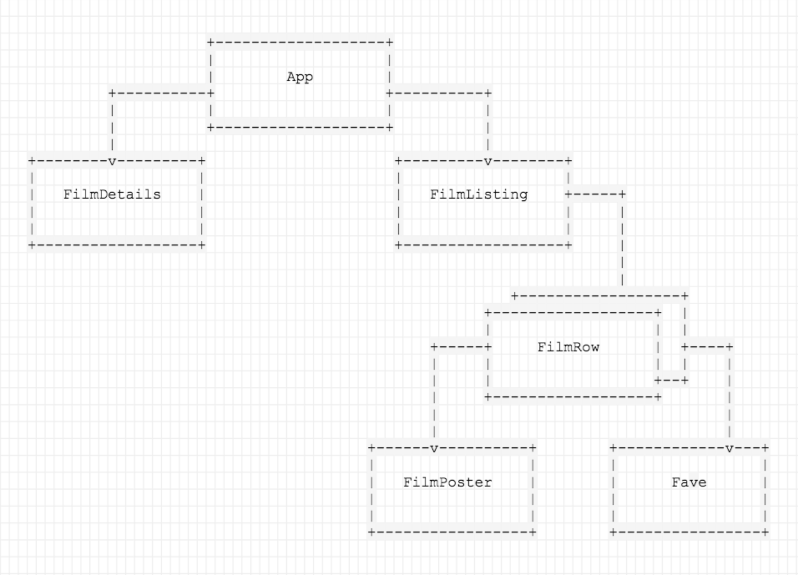

## Day One

#  Starting a Film Project

Fork and clone the `react-film` repo.

Generate a new app with `npx create-react-app filmapp`

## Your Mission

Today the plan is to identify the app components, create the overall structure, then split that structure into individual components. You'll pass films as props to each component and ultimately use iteration to render one component for each film. At the end of this exercise, you will have this app:


### Tasks

**Importantly**: After each step below, check your application to see how it looks before going to the next one. It's good practice to be sure your app is working correctly before adding new functionality.

<details>
  <summary>Hint</summary>
  Don't forget any <code>import</code> statements as you add more files.
</details>

#### Step 1: Create baseline layout

First, create the layout. You'll have a Films column and a Details column.

Make the provided `App` component render the following code:

```html
<div className="film-library">
  <div className="film-list">
    <h1 className="section-title">FILMS</h1>
  </div>

  <div className="film-details">
    <h1 className="section-title">DETAILS</h1>
  </div>
</div>
```

#### Step 2: Create new components

Move the `film-list` and `film-details` into their own separate components (in separate files), `FilmListing` and `FilmDetails`, respectively.

Make sure you now call these components in `App.js`. Check your app in the browser. If you've done it right, nothing will have changed, and the application will look the same.

#### Step 3: Pass props to the new components

Pass the films (stored in `TMDB.films`) to each of your new components as props.

If you check your file, it still shouldn't look differently. We're sending the props to the components, but we are not using the props yet.

<details>
  <summary>Hint</summary>
  For now, this step is just changing the <code>App.js</code> file to be sure it imports the film file and passes props.
</details>

#### Step 4: Render a film

In the `FilmListing` component, render the title of just 1 film as an `<h1>`, below the `section-title`.

Does "It" appear on the left side of your browser?

<details>
  <summary>Hint</summary>
  The films prop is an array, and you just want the title from the first one.
</details>


#### Step 5: Create and render an array of film title elements

Use `.map()` inside of the `FilmListing` to iterate over the collection of films and create an element for each one. (Here is the [map documentation](https://developer.mozilla.org/en-US/docs/Web/JavaScript/Reference/Global_Objects/Array/map)).

Then, render the variable `allFilms` underneath the Films `<h1>`.

You should have a list of all the films appear in the left column.

<details>
  <summary>Hint - Need help on <code>map</code>?</summary>
  This step will look like this in your <code>render</code> method (above the <code>return</code>):
  <code> let allFilms = this.props.films.map( (film, index) => ( your-jsx-per-film-here ))</code>
    Then, you'll just need to call <code>{allFilms}</code> in your JSX where you want the titles to appear.
</details>


#### Step 6: Move the film rows to their own component

Create a new component for each film row, called `FilmRow.js`. Have your `map` instead create an array of `FilmRow`s. Don't forget to pass the individual film prop to the component when creating them!

Once you have this working, also pass `film.id` as a `key` prop to `FilmRow`, though you won't use it yet.


#### Step 7: Flesh out each film row

Make each film row in the film list look like the main finished image, using the following markup (replace "TITLE" and "YEAR" with the actual title and year of the film).

```
<div className="film-row">
  

  <div className="film-summary">
    <h1>TITLE</h1>
    <p>YEAR</p>
  </div>
</div>
```

- You'll have to create the `posterUrl` for each film by combining the prefix `https://image.tmdb.org/t/p/w780/` with each film's `poster_path` property.

- You'll also have to extract the year from the `release_date` property. To do this, you'll need to figure out how to use the [`getFullYear()`](https://developer.mozilla.org/en-US/docs/Web/JavaScript/Reference/Global_Objects/Date/getFullYear) JS method.

<details>
  <summary>Hint on <code>getFullYear()</code></summary>
  <code>getFullYear()</code> will be a single line of new code, and you'll use the keywords <code>new</code> and <code>Date</code>.
</details>


#### Step 8: Move film posters to their own component

Since the poster requires you to create the URL first, move those elements to their own component. This could be reusable later. Don't forget to pass the film as a prop to the new `FilmPoster` component.

#### PART 1 Complete!


## Day Two
#  

## Film Exercise: State

Your goal today is to add some events to your app. You'll keep these events simple for now; each will simply print a message to the console.

In the future, however, you're going to be able to add films to your list of favorites, filter the films to see only your favorites, and see the details for a specific film. Your work today will make that possible.


### Tasks — Part 1: Adding Favorites

#### Step 1: Add a New `Fave` Component

Before we get started, let's install `@material-ui/icons` and `@material-ui/core` packages using `npm install` command.

After that, create a new component called `Fave` that will eventually handle whether or not a movie is a user's favorite. The `Fave` component's `render()` method should return the following:

```html
<div className="film-row-fave add_to_queue">
    <AddToQueueIcon />
</div>
```

Don't forget to import the icon! `import AddToQueueIcon from '@material-ui/icons/AddToQueue';`
In the `FilmRow` component, underneath the `film-summary` `div`, render the `Fave` component.

In your browser, the icon should appear in the bottom-right corner of each film row.

#### Step 2: Define a `handleClick` Function in `Fave`

Inside the `Fave` component, define a function called `handleClick`. The function should accept an event (`e`) as an argument. Simply log out a message such as `"handling Fave click!"` for now.

Because you aren't using this anywhere yet, nothing should change.

<details>
  <summary>Hint</summary>
  This will look like this:
  <code> handleClick = (e) => {} </code>
</details>

#### Step 3: Add an `onClick` in `Fave`

Now that you have a function that handles the user clicking a movie, connect it to the UI. In the `div` of `Fave`'s `render()` function, add a parameter of `onClick={this.handleClick}`.

In your browser's JavaScript console, you should see the message `handleClick` print out when the `div` is clicked.

That's all! Your click is not yet adding favorites, but it is working. Later, you will modify your app so that, when the `Fave` icon is clicked, your app adds or removes the selected movie from the user's favorites array.


### Tasks — Part 2: Handling Filter Toggling

Eventually, you'll want an `ALL` heading and a `FAVES` heading that are clickable links: When the user clicks `ALL`, the left sidebar will show all movies; when the user clicks `FAVES`, the left sidebar will show only their favorite movies. Now, you'll create the foundation for that functionality.

#### Step 1: Define a `handleFilterClick` Function in `FilmListing`

First, set up the function that will determine what movies are shown in the list. You'll need to be able to tell if you are showing the user all of the movies or if you are filtering down to show the user just some of the movies.

In `FilmListing`, create a `handleFilterClick` function that takes a string `filter` as an argument. For now, just print a message that says `Setting filter to ` and the `filter` argument.

This new function isn't connected to a button in the UI yet, so nothing should change.

#### Step 2: Add Provided Markup to Display the `ALL`/`FAVES` Menu

Add some markup to the `FilmListing` component so that you can have something worth clicking. You'll keep the `FILMS` heading; underneath it, you'll add two categories of `ALL` and `FAVES`. You're also setting up displaying the film's length, which you aren't using yet.

Change the `FilmListing` component to render this:

```html
<div className="film-list">
    <h1 className="section-title">FILMS</h1>
    <div className="film-list-filters">
        <div className="film-list-filter">
            ALL
            <span className="section-count">{this.props.films.length}</span>
        </div>
        <div className="film-list-filter">
            FAVES
            <span className="section-count">0</span>
        </div>
    </div>

    {allFilms}
</div>
```

If you check your browser, these subheadings should appear in the left column.

#### Step 3: Add `onClick` Inside `FilmListing` to Trigger Filtering to `'faves'`

Now you have an `ALL` section and a `FAVES` section; you can hook the latter up to that filtering function you just created.

Add an `onClick` inside `FilmListing` so that, when `FAVES` is clicked, it calls the `handleFilterClick()` method you created with the `'faves'` parameter.

<details>
  <summary>Hint</summary>
  This will look like this:
  <code>onClick={() => this.handleFilterClick('faves')}</code>
</details>


Try clicking `FAVES`. Does it print to the console?

#### Step 4: Add `onClick` Inside `FilmListing` to Trigger Filtering to `'all'`

`FAVES` is now clickable, so the next step is to also make `ALL` clickable.

Add an `onClick` inside `FilmListing` so that, when `ALL` is clicked, it calls the `handleFilterClick()` method with argument `'all'`.

You should see a message in the console when you click either option. Later, instead of viewing a message, clicking either option will display the correct list of movies. But for now, you've ensured that the options are clickable, which is an important first step.

### Tasks — Part 3: Handling Film Details

You aren't going to create the large detailed view of the film that will be displayed in the right column (yet), but you're going to start setting up for it.

#### Step 1: Define a `handleDetailsClick()` Function Inside `FilmRow`

Inside `FilmRow`, define a function called `handleDetailsClick()`. The function should accept a `film` as an argument. Print out `Fetching details for ` and the film title to the console.

Because this function isn't connected to the UI yet, nothing will change.

#### Step 2: Add a Click Handler to Call the New Function With a Film Object

Now, connect `handleDetailsClick()`. Add an `onClick` to `FilmRow` so that your message gets printed whenever you click on a film row (don't forget to pass the argument).

You should be able to check this in your console by clicking any film row.

#### Step 3: Add `stopPropagation()` to the `handleFave` Event Handler

Hold up! Notice that you are now seeing two messages every time you click on the `Fave` icon/button. This is tricky, but the reason is because the event is propagating upward to the `FilmRow`. To make it so only one message appears, you'll need to stop the event propagation.

To do this, add the line `e.stopPropagation()` inside the `Fave` component's `handleClick()` function.

Try clicking the `Fave` icon/button; there's only one message now.

### Tasks — Part 4: Add State to the `Fave` Component

You have now triggered the events you'll need to update your app. Next, you'll add states to your app: Data in your React app that will change (such as if the user adds a film to their favorites list).

#### Step 1: Create a Constructor for the `Fave` Component

The first state you'll add will be whether or not a currently selected film is a user's favorite.

#### Step 1: Set the Initial State

By default, a film is not a user's favorite.

Back to the `Fave` component; set `this.state` to an object with the key `isFave` and the value `false`. This will set up the initial state of the component.

#### Step 2: Set the State in Your Event Handler

When the user clicks the `Fave` icon/button to add or remove a film from their favorites list, the app should change the film's `isFave` state to reflect that.

Inside of the `handleClick()` method in the `Fave` component, use `this.setState()` to toggle the value of `isFave`. "Toggle" means you always want to set the new value to the opposite of the current value.

<details>
  <summary>Hint — one way to do this could be:</summary>
  <code>this.setState(prevState => ({
			isFave:!prevState.isFave
		}))</code>
</details>


#### Step 3: Set the `className` on `div` Based on the `IsFave` State

You want the `className` attribute on the `div` to dynamically update when the state is changed. Currently, the `className` on the `div` is `add_to_queue`. However, if the film is already favorited, then the film is already in the queue. Therefore, when `isFave: true`, the `className` should instead be `remove_from_queue`.

You need to make this happen:

- When `isFave: true`, you want to give the `div` the class `remove_from_queue`. When `isFave: false`, you want to give the `div` the class `add_to_queue`.
- You also want to change the text that's rendered in the `p` to be the same text as the class `remove_from_queue` or `add_to_queue`.

**Note**: It will be easier to read if you determine which class to set first, store that value in a variable, and then insert that variable into the `className` attribute.

<details>
  <summary>Hint: A more advanced and succinct way of writing this function could be:</summary>
  <code>const isFave = (this.state.isFave) ? 'remove_from_queue' : 'add_to_queue'</code>

  You can drop this in the <code>render()</code> method. This checks the current <code>isFave</code> state for <code>true</code> or <code>false</code>.

  If it's <code>true</code>, it sets the <code>const</code> variable <code>isFave</code> to <code>remove_from_queue</code>; when it's <code>false</code>, it sets the <code>const</code> variable <code>isFave</code> to <code>add_to_queue</code>.
</details>

Once you have this, clicking the `Add` icon in each row should change the icon that's displayed.

### Tasks — Part 5: Add State to `FilmListing` Component

Currently, you have the `ALL` and `FAVES` headings, but all films are always shown. Next, you'll add a state so that you can track if the user is currently filtering to view _all_ movies or only their _faves_.

#### Step 1: Set the Initial State

By default, a user will view the entire list of movies.

In the `FilmListing` component, set `this.state` to an object with the key `filter` and the value `all`. This will set up the initial state of the component.

#### Step 2: Set the State in Your Event Handler

The `handleFilterClick()` method is the one that's called when a user clicks `ALL` or `FAVES`, so it's where you'll change the filter.

Inside of the `handleFilterClick()` method in the `FilmListing` component, use `this.setState()` to set the value of `filter` to the value passed to the event handler.

#### Step 3: Set the `className` on `div` based on `filter` State

To give the user a clue as to where they are, the `ALL` and `FAVES` `div`s should change color depending on which is active. In the CSS, we've already set the colors using a class; you'll need to dynamically change the class of each `div`.

Now, you want the `className` attribute on each `.film-list-filter` `div` to dynamically update when the state is changed. When `filter: all`, you want to give the `div` the class `is-active` to the `ALL` filter. When `filter: faves`, you want to give the `div` the class `is-active` to the `FAVES`.

<details>
  <summary>Hint: One way to do this could be by adding a line similar to this (different for each <code>div</code>) into the <code>className</code> parameter:</summary>
  This line in particular checks if the <code>filter</code> state is currently <code>'all'</code>; if it is, it sets the value to <code>is-active</code>. If it isn't, it does nothing: <code>{this.state.filter === 'all' ? 'is-active' : ''}</code>.
</details>

Check your browser to make sure that everything works.

#### Part 2 Complete!
- Commit the day's work as Part-2 complete ! ~ 


## Day Three

#  Lifting State

## Your Mission

You're almost finished! Now you need to:

- Add films to a user's faves.
- Filter the films the user is looking at.

To do this, you'll need to move your state up to the top of the component tree so that all of the data is more easily shared across components. Remember unidirectional flow: Data is going to go down the component tree, so you'll want your states to be as high up as possible.



### Task 1: Add State to the `App` Component

Your `App` component will be the main place where states are set. From here, these states can be passed as props down to the other components.

#### Step 1: Initialize the State Object

In `App.js`, initialize a state.

Set three states:

1. `films`: Initialize this key to hold a reference to `TMDB.films`.
2. `faves`: This key should simply start off as an empty array.
3. `current`: This key should start off as an empty object.

#### Step 2: Pass State Values to `FilmListing` and `FilmDetails` as Props

Now that you have state stored on the `App` component, you want to pass those as props to your child components. Just change `App.js` for now:

- `FilmListing` should receive a `films` prop that now references your state's `films` property and a `faves` prop that should reference your state's `faves` property.

- `FilmDetails` should receive a `films` prop that references your state's `current` property.

Because you aren't doing anything with these props yet, nothing should change.

### Task 2: Move the `Fave` Event Handler Up the Component Tree

When a user favorites a film, that information needs to be shared with the rest of your components. For example, `FilmListing` needs to know which films are favorites to enable the filter.

This isn't possible right now, because you're currently handling the favorite-toggling of a film on the `Fave` component. The `Fave` component is located at the bottom of the component hierarchy, and props and state only flow downward. Additionally, the `Fave` component doesn't even know which film is being favorited, so this isn't a great place to store a state for whether or not a film is a favorite.

Let's fix this:

#### Step 1: Remove the State Setter in the `Fave` Constructor

Take the `isFave` state out of the `Fave` constructor.

#### Step 2: Replace `setState()` in the `handleFaveClick()` Handler

Because you're no longer holding the state in the `Fave` component, you don't want to set the `isFave` state in the `handleClick()` event handler anymore.

Instead, assume that the parent component will pass a handler called `onFaveToggle()` to you through the `props` object.

Change `handleClick()` as follows:

```js
# /src/Fave.js

handleClick = (e) => {
  e.stopPropagation()
  console.log('Handling Fave click!')

  // Add this line. You'll call the function passed through props.
  this.props.onFaveToggle()

  // Delete the setState() line. You no longer track state here.
  // this.setState({isFave: !this.state.isFave})
}
```

This way, when a user clicks, `onFaveToggle()` will be called at a higher component level.

#### Step 3: Change `isFave` to a Prop Rather Than a State

You've taken the `isFave` state out of `Fave` and will be passing a prop called `isFave` instead. In the `Fave` component, replace `this.state.isFave` with `this.props.isFave`. You'll send that information down from a parent component that knows this info.

This is all you need to change in `Fave.js`! It will still check to see if the user has clicked the `Fave` toggle button. The difference is that, once the user clicks, instead of changing the `faves` array directly, the `handleClick()` function will instead call `onFaveToggle()` to do it instead.

You'll define `onFaveToggle()` in a higher component.

#### Step 4: Define `handleFaveToggle()` on the `App` Component

The `Fave` component is expecting a prop, but one doesn't exist yet. Let's change that.

You'll move the favorite toggle functionality all the way up to the `App` component, where the state for `films` and `faves` is stored.

In the `App` component, create a `handleFaveToggle()` function. It doesn't need to do anything yet, but soon you'll update the `faves` array when a film is favorited or unfavorited. The `handleFaveToggle()` function should accept a film object as an argument (this will be the film that the user is toggling on).

<!-- #### Step 5: Bind the Handler to the Component

As you saw previously, if use a method without an arrow function then you need to bind your custom component methods to ensure `this` refers to the component within the body of the method.

Add the following to the `App` component's constructor:

```js
this.handleFaveToggle = this.handleFaveToggle.bind(this)
``` -->

#### Step 5: Clone the `faves` State

To recap, the `faves` state is going to hold the user's favorite films. Your goal: When the user clicks the icon to favorite or unfavorite a film, either add or remove the given film from the `faves` array.

To do this, you need to call `setState()` and give it the updated array (you can't just update it directly; otherwise React won't know to re-render the components to reflect the changes). To accomplish this, you'll make a copy of the existing faves array, update it, and then pass the copy to `setState()`.

First, just make a copy. Inside `handleFaveToggle()`, use the JavaScript [`Array.prototype.slice()`](https://developer.mozilla.org/en-US/docs/Web/JavaScript/Reference/Global_Objects/Array/slice) method to make a copy and store it in a variable called `faves`.

#### Step 6: Find the Index of the Passed Film in the `faves` Array

Underneath the slice, use the JavaScript [`Array.prototype.indexOf()`](https://developer.mozilla.org/en-US/docs/Web/JavaScript/Reference/Global_Objects/Array/indexOf) method to store the position of the film in the array in a `const` variable called `filmIndex`.

Now, `filmIndex` will be an index value starting at `0`.

#### Step 7: Set Up a Conditional for Adding or Removing Film From the `faves` Array

If the film is found in the array, `indexOf()` will return an index value starting at `0`. Conversely, `indexOf()` will return `-1` if the element isn't found (if the film it's looking for isn't currently in the `faves` array).

Because this `handleFaveToggle()` function is designed to change the array of the user's favorite films, there are two options:

- If the film is already in their favorites, then when the user clicks the button, they want to remove it from their favorites. You need to take it out of the `faves` array.
- If the film is not in their favorites, then when the user clicks the button, they want to add it to their favorites. You need to add it to the `faves` array.

Write a conditional statement with the two cases. When adding a film to `faves`, log out `Adding [FILM NAME] to faves...`; when removing a film from `faves`, log out `Removing [FILM NAME] from faves...`.

#### Step 8: Change Whether or Not the Film is in `faves`

To remove a film that's already in the `faves` array, use the [`Array.prototype.splice()`](https://developer.mozilla.org/en-US/docs/Web/JavaScript/Reference/Global_Objects/Array/splice) method.

To add a new film to the `faves` array, just [push()](https://developer.mozilla.org/en-US/docs/Web/JavaScript/Reference/Global_Objects/Array/push) it on to the end of the array.

#### Step 9: Use `setState()` to Update the State of `faves`

Now that you have updated the `faves` array, you need to call `setState()` so React will re-render the appropriate components in the tree. You can make this very succinct by using object literal shorthand. It should look like this:

```js
this.setState({ faves });

// The above is exactly the same as this.setState({faves: faves}).
```

#### Step 10: Pass the `handleFaveToggle()` Function to `FilmListing` Through Props

Now that the `handleFaveToggle()` method lives on the `App` component, you'll want to pass it all the way down the tree so that you can call it when the `Fave` button is clicked.

In the `App` component's `render()` method, add a new prop to the `FilmListing` component called `onFaveToggle`. Its value should be a reference to the `handleFaveToggle()` method you just finished writing.

#### Step 11: Pass the `onFaveToggle()` Function to `FilmRow` Through Props

In the `FilmListing` component, you render one `FilmRow` component for each film in the `films` prop. You need to pass the `onFaveToggle()` function down to each `FilmRow` (with the ultimate goal being that you call it in the `Fave` component), but you want to ensure that it passes the current film up to the `handleFaveToggle()` method in the `App` component when called.

To make this happen, you won't simply pass the function down to `FilmRow` as a prop as-is; you'll wrap it in another function that simply calls the `onFaveToggle()` function passed down from `App` through props (remember, `onFaveToggle()` in `FilmListing` is just a reference to `handleFaveToggle()` in the `App` component).

In the `FilmListing` component's `render()` method, add the `onFaveToggle` variable. Replace your existing `.map()` function with this:

```js
const allFilms = this.props.films.map((film) => {
  return (
    <FilmRow
      film={film}
      key={film.id}
      onFaveToggle={() => this.props.onFaveToggle(film)}
    />
  );
});
```

#### Step 12: Pass the `onFaveToggle()` Function to `Fave` Through Props

Now, the `FilmRow` component is receiving the `onFaveToggle`() function as a prop. However, the `FilmRow` component doesn't need the function; the `Fave` component does. You'll pass it along as a prop to `Fave`.

In `FilmRow`'s `render()` function, where you call the `Fave` component, add a prop called `onFaveToggle` and pass it the `onFaveToggle` prop that `FilmRow` received.

Great! The `onFaveToggle()` function is now being passed from the `App` component where it's defined, down to the `FilmListing` component, down to the `FilmRow` component, down to the `Fave` component.

#### Step 13: Pass `isFave` Down From `FilmListing` Through `FilmRow`

The `Fave` component is also expecting to receive a prop called `isFave`, so you need to pass `isFave` to the `Fave` component from `FilmRow`.

`FilmRow` doesn't know about the `faves` array, but its parent, `FilmListing`, does.

The `isFave` prop should be `true` or `false` depending on whether the film is in the `faves` array.

In `FilmListing`, when creating each `FilmRow`, pass a prop called `isFave` whose value uses the [`Array.prototype.includes()`](https://developer.mozilla.org/en-US/docs/Web/JavaScript/Reference/Global_Objects/Array/includes) method to determine if the film is in the `faves` array or not.

Now `FilmRow` is getting the `isFave` prop, but it doesn't need it. It only needs to pass it along. In `FilmRow`, pass that prop through to `Fave`.

`Fave` is now getting the `true` or `false` Boolean of whether or not a film is a favorite (`isFave`), as well as being passed the favorite toggle function (`onFaveToggle()`).

`Fave` has everything it needs!

Look in your browser to see this working: The JavaScript console will log if something is added or removed from the user's favorites.

#### Step 14: Update `Faves` Counter

Currently in the browser, the `faves` counter the user sees is always `0`. You'll update the counter in the `FilmListing` to accurately show the number of faves in the array.

If you look at what's rendered in the `FilmListing` component, right now the `faves` counter is hard-coded to `0`. Replace that with the length of the `faves` array that is received through the props.

Now you have favorites properly stored and available to all components, and you have a counter that accurately reflects that to the user.

Great job! Check it out in your browser.

### Task 3: Move the Details Event Handler Up Component Tree From `FilmRow`

In `FilmRow`, there's still the function to handle when a user clicks a row for more details.

Following the same steps as you did for the `Fave` event handler, move the `handleDetailsClick()` definition to the `App` component.

For `handleDetailsClick()` in the `App` component, just log to the console and set the `current` state to the passed film for now. You'll handle looking up film details later. Make sure you pass the `current` state as a `film` prop to the `FilmDetails` component.

### Task 4: Make the Filter Work on `FilmListing`

You have the `filter` state on `FilmListing`, but you still need to make it actually change the UI. You're not going to move the `filter` state, because this filter only affects the `FilmListing`, not any other parts of the app.

Add a conditional in `FilmListing` so that, if the `filter` state is set to `filter`, the listing only shows films in the `faves` array. Otherwise, it shows all films.

Try it out! You should be able to add films to your favorites and view just your favorites list by clicking that tab.

#### Part 3 Complete!
- Commit the day's work as Part-3 complete 
